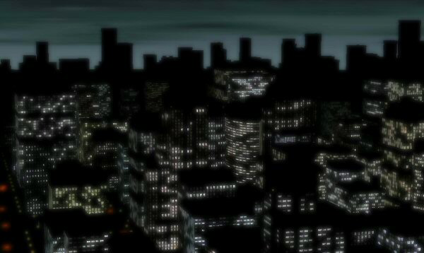
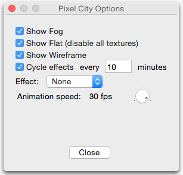
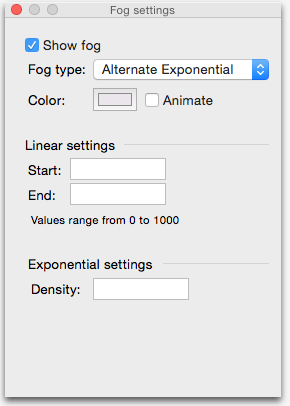

# pixelcity-osx-port
This is a port of Pixel City by Shamus Young converted to Mac OS X.
The original Pixel City project index is at http://www.shamusyoung.com/twentysidedtale/?page_id=16458.

This project can build a stand-alone application or a screensaver (or both).  Select the target from the Xcode window to choose which to build.  The application contains more settings and effects than the screensaver; some of these are for debugging and some are experimental and haven’t been ported across yet.

You can install the screensaver by double-clicking on the .scr file.

This screensaver uses old-style OpenGL calls (i.e. pre-1.5) and no shaders. I intend to modify it to use shaders as a learning exercise later on.

I have exposed some of the screensaver settings as options, shown below:

I have also added some fog settings, including colour-cycling the fog settings.

